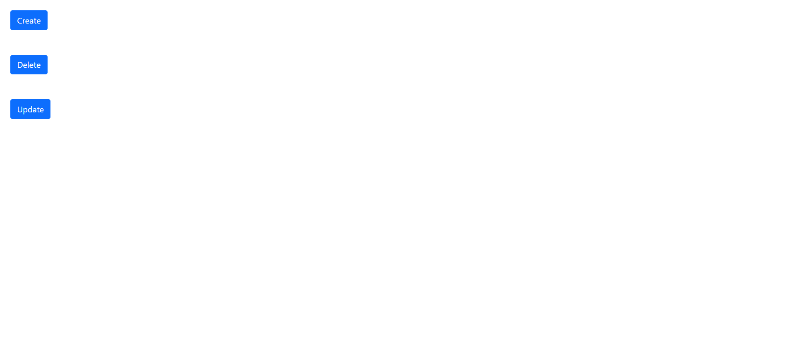

# Archive

## Aim

This project aims to facilitate access to papers from previous semesters.

# Home Page

This pages shows the list of departments available.

    

# Branch Page

This page displays all the courses that are available in a choosen branch.

All the available courses are displayed in a table along with their course id,course name, course information link,a button to access previous papers of the course.

    

# Course page

This page displays the list of previous papers available related to the selected course.

All the available papers are displayed in a table along with topics,year of the question paper, its type ( midsem, endsem, assignment etc ) ,document id , a button to view the paper

    
    

# Admin

Admin can add,remove/update a paper.

    
    

    
    

